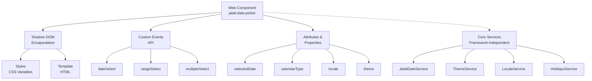

# طراحی Web Component: Jalali Date Picker

## خلاصه

تبدیل کتابخانه Angular موجود Jalali Date Picker به Web Component استاندارد (Custom Element) که از Shadow DOM استفاده کند و در هر فریمورک (React, Vue, Vanilla JS) و حتی بدون فریمورک قابل استفاده باشد. این تبدیل تمام قابلیت‌های موجود (21 تم، 3 سیستم تقویم، محلی‌سازی، RTL) را حفظ می‌کند و API ساده‌ای برای تعامل فراهم می‌کند.

## معماری کلی



## ساختار فایل‌ها

```
projects/jalali-web-component/
├── src/
│   ├── lib/
│   │   ├── web-component/
│   │   │   ├── jalali-date-picker.element.ts      # Custom Element
│   │   │   ├── web-component.styles.ts            # Styles as strings
│   │   │   └── web-component.template.ts          # Template as strings
│   │   ├── core/
│   │   │   ├── services/
│   │   │   │   ├── jalali-date.service.ts         # (موجود - بدون تغییر)
│   │   │   │   ├── theme.service.ts               # (موجود - بدون تغییر)
│   │   │   │   ├── locale.service.ts              # (موجود - بدون تغییر)
│   │   │   │   └── holidays.service.ts            # (موجود - بدون تغییر)
│   │   │   ├── models/
│   │   │   │   └── (موجود - بدون تغییر)
│   │   │   └── utils/
│   │   │       └── (موجود - بدون تغییر)
│   │   ├── adapters/
│   │   │   ├── angular-adapter.ts                 # برای سازگاری Angular
│   │   │   └── framework-bridge.ts                # پل ارتباطی
│   │   └── public-api.ts
│   └── index.ts
├── package.json
└── README.md
```

## معماری Web Component

### 1. Custom Element (jalali-date-picker.element.ts)

Web Component اصلی که:
- Shadow DOM را ایجاد می‌کند
- Attributes و Properties را مدیریت می‌کند
- Custom Events را emit می‌کند
- Lifecycle hooks را پیاده‌سازی می‌کند

### 2. Shadow DOM Encapsulation

- **Styles**: CSS Variables برای تم‌ها، بدون تأثیر بر سایر عناصر
- **Template**: HTML ساختار داخلی
- **Slot**: برای محتوای سفارشی (اختیاری)

### 3. API (Attributes & Properties)

#### Attributes (String-based)
```
<jalali-date-picker
  selected-date="2024-01-15"
  calendar-type="jalali"
  locale="fa"
  theme="glassmorphism"
  selection-mode="single"
  disabled
  show-theme-selector
  show-color-picker
  show-calendar-switch>
</jalali-date-picker>
```

#### Properties (JavaScript)
```typescript
const picker = document.querySelector('jalali-date-picker');

// Read/Write
picker.selectedDate = new Date();
picker.calendarType = 'jalali';
picker.locale = 'fa';
picker.theme = 'glassmorphism';
picker.selectionMode = 'single';
picker.disabled = false;

// Read-only
picker.value; // تاریخ انتخاب شده
picker.selectedRange; // محدوده انتخاب شده
picker.selectedDates; // تاریخ‌های انتخاب شده
```

#### Custom Events
```typescript
picker.addEventListener('dateSelect', (e) => {
  console.log('Selected date:', e.detail.date);
});

picker.addEventListener('rangeSelect', (e) => {
  console.log('Range:', e.detail.range);
});

picker.addEventListener('multipleSelect', (e) => {
  console.log('Dates:', e.detail.dates);
});

picker.addEventListener('localeChange', (e) => {
  console.log('Locale:', e.detail.locale);
});

picker.addEventListener('themeChange', (e) => {
  console.log('Theme:', e.detail.theme);
});
```

## مراحل تبدیل

### مرحله 1: استخراج Core Services

**هدف**: جدا کردن منطق تجاری از Angular

**اقدامات**:
- تمام Services را بدون وابستگی Angular بازنویسی کنید
- استفاده از Vanilla TypeScript
- حفظ تمام الگوریتم‌های موجود

**خروجی**:
- `JalaliDateService` (بدون Injectable)
- `ThemeService` (بدون Injectable)
- `LocaleService` (بدون Injectable)
- `HolidaysService` (بدون Injectable)

### مرحله 2: ایجاد Web Component

**هدف**: Custom Element استاندارد ایجاد کنید

**اقدامات**:
1. کلاس اصلی که HTMLElement را extend کند
2. Shadow DOM setup در constructor
3. Lifecycle methods: connectedCallback, disconnectedCallback, attributeChangedCallback
4. Property getters/setters
5. Event dispatching

**خروجی**:
- `JalaliDatePickerElement` class
- Shadow DOM template و styles

### مرحله 3: Styling Strategy

**هدف**: تم‌ها را بدون Angular بکار بندید

**اقدامات**:
1. تمام SCSS را به CSS تبدیل کنید
2. CSS Variables برای تم‌ها
3. Styles را به TypeScript strings تبدیل کنید
4. Shadow DOM میں inject کنید

**خروجی**:
- CSS Variables برای هر تم
- Encapsulated styles

### مرحله 4: Angular Adapter (اختیاری)

**هدف**: سازگاری با Angular برای کاربران موجود

**اقدامات**:
1. Angular wrapper component
2. ControlValueAccessor implementation
3. Two-way binding support

**خروجی**:
- `JalaliDatePickerComponent` (Angular wrapper)

## Components & Interfaces

### Core Interfaces

```typescript
// تاریخ انتخاب شده
interface DatePickerValue {
  date: Date | null;
  jalaliDate: string;
  gregorianDate: string;
  hijriDate: string;
}

// محدوده تاریخ
interface DateRange {
  start: Date | null;
  end: Date | null;
}

// تنظیمات تم
interface ThemeConfig {
  name: string;
  colors: {
    primary: string;
    secondary: string;
    accent: string;
    background: string;
    text: string;
  };
}

// تنظیمات محلی‌سازی
interface LocaleConfig {
  code: 'fa' | 'en';
  direction: 'rtl' | 'ltr';
  monthNames: string[];
  dayNames: string[];
  dayShortNames: string[];
}

// Custom Event Detail
interface DateSelectDetail {
  date: Date;
  jalaliDate: string;
  gregorianDate: string;
  hijriDate: string;
}

interface RangeSelectDetail {
  range: DateRange;
}

interface MultipleSelectDetail {
  dates: Date[];
}
```

### Web Component Class Structure

```typescript
class JalaliDatePickerElement extends HTMLElement {
  // Private fields
  private shadowRoot: ShadowRoot;
  private dateService: JalaliDateService;
  private themeService: ThemeService;
  private localeService: LocaleService;
  private holidaysService: HolidaysService;
  
  // State
  private _selectedDate: Date | null = null;
  private _selectedRange: DateRange = { start: null, end: null };
  private _selectedDates: Date[] = [];
  private _calendarType: 'jalali' | 'gregorian' | 'hijri' = 'jalali';
  private _locale: 'fa' | 'en' = 'fa';
  private _theme: string = 'light';
  private _selectionMode: 'single' | 'range' | 'multiple' = 'single';
  private _disabled: boolean = false;
  
  // Lifecycle
  constructor();
  connectedCallback(): void;
  disconnectedCallback(): void;
  attributeChangedCallback(name: string, oldValue: string, newValue: string): void;
  
  // Static
  static get observedAttributes(): string[];
  
  // Properties
  get selectedDate(): Date | null;
  set selectedDate(value: Date | null);
  
  get selectedRange(): DateRange;
  set selectedRange(value: DateRange);
  
  get selectedDates(): Date[];
  set selectedDates(value: Date[]);
  
  get calendarType(): 'jalali' | 'gregorian' | 'hijri';
  set calendarType(value: 'jalali' | 'gregorian' | 'hijri');
  
  get locale(): 'fa' | 'en';
  set locale(value: 'fa' | 'en');
  
  get theme(): string;
  set theme(value: string);
  
  get selectionMode(): 'single' | 'range' | 'multiple';
  set selectionMode(value: 'single' | 'range' | 'multiple');
  
  get disabled(): boolean;
  set disabled(value: boolean);
  
  get value(): string; // ISO date string
  
  // Methods
  private initializeShadowDOM(): void;
  private setupEventListeners(): void;
  private render(): void;
  private updateStyles(): void;
  private emitEvent(eventName: string, detail: any): void;
  
  // Public API
  open(): void;
  close(): void;
  reset(): void;
  setDate(date: Date): void;
  setRange(start: Date, end: Date): void;
  addDate(date: Date): void;
  removeDate(date: Date): void;
}
```

## Data Models

### تاریخ و تبدیل‌ها

```typescript
// نمایش داخلی تاریخ
interface InternalDate {
  jalali: {
    year: number;
    month: number;
    day: number;
  };
  gregorian: {
    year: number;
    month: number;
    day: number;
  };
  hijri: {
    year: number;
    month: number;
    day: number;
  };
  dayOfWeek: number; // 0-6
  timestamp: number;
}

// تاریخ‌های غیرفعال
interface DisabledDateConfig {
  dates?: Date[];
  ranges?: DateRange[];
  weekDays?: number[]; // 0-6
  predicate?: (date: Date) => boolean;
}

// تنظیمات تعطیلات
interface HolidayConfig {
  date: Date;
  name: string;
  type: 'holiday' | 'event' | 'custom';
  color?: string;
}
```

## Error Handling

### خطاهای ممکن

```typescript
enum DatePickerError {
  INVALID_DATE = 'INVALID_DATE',
  INVALID_RANGE = 'INVALID_RANGE',
  INVALID_LOCALE = 'INVALID_LOCALE',
  INVALID_THEME = 'INVALID_THEME',
  INVALID_CALENDAR_TYPE = 'INVALID_CALENDAR_TYPE',
  INITIALIZATION_FAILED = 'INITIALIZATION_FAILED'
}

interface ErrorDetail {
  code: DatePickerError;
  message: string;
  context?: any;
}
```

### Error Event

```typescript
picker.addEventListener('error', (e: CustomEvent<ErrorDetail>) => {
  console.error(`Error [${e.detail.code}]: ${e.detail.message}`);
});
```

## Testing Strategy

### Unit Testing

- **Services**: تست تبدیل‌های تاریخ، محاسبات
- **Web Component**: تست lifecycle، properties، events
- **Utilities**: تست توابع کمکی

### Property-Based Testing

- **Date Conversions**: تست تبدیل‌های دوطرفه
- **Range Validation**: تست محدوده‌های تاریخی
- **Locale Handling**: تست تمام زبان‌های پشتیبانی شده

### Integration Testing

- **Framework Integration**: React, Vue, Vanilla JS
- **Event Handling**: تست تمام events
- **Theme Switching**: تست تغییر تم‌ها

## Performance Considerations

### بهینه‌سازی‌ها

1. **Lazy Rendering**: فقط ماه‌های نمایش داده شده را رندر کنید
2. **Event Delegation**: استفاده از event delegation برای کلیک‌ها
3. **Memoization**: کش کردن محاسبات تاریخ
4. **CSS Containment**: استفاده از `contain: layout style paint`
5. **Virtual Scrolling**: برای لیست‌های بزرگ

### Metrics

- **LCP**: < 2.5s
- **FID**: < 100ms
- **CLS**: < 0.1
- **Bundle Size**: < 150KB (gzipped)

## Security Considerations

### XSS Prevention

- استفاده از `textContent` به جای `innerHTML`
- Sanitize user input
- Content Security Policy

### Data Privacy

- بدون ارسال داده‌ها به سرور
- تمام محاسبات محلی
- localStorage برای تنظیمات کاربر

## Dependencies

### External

- **None** برای Core Services
- **Optional**: TypeScript (development only)

### Internal

- Core Services (موجود)
- Utilities (موجود)
- Models (موجود)

## Browser Support

- Chrome/Edge: 67+
- Firefox: 63+
- Safari: 10.1+
- IE: Not supported (Web Components)

## Backward Compatibility

### Angular Users

- Angular wrapper component برای سازگاری
- ControlValueAccessor support
- Two-way binding support
- Existing API maintained

### Migration Path

```typescript
// قدیم (Angular)
<jalali-date-picker
  [(selectedDate)]="date"
  (dateSelect)="onSelect($event)">
</jalali-date-picker>

// جدید (Web Component)
<jalali-date-picker
  id="picker">
</jalali-date-picker>

<script>
  const picker = document.getElementById('picker');
  picker.selectedDate = new Date();
  picker.addEventListener('dateSelect', (e) => {
    console.log(e.detail.date);
  });
</script>
```

---

# طراحی جزئی: پیاده‌سازی

## الگوریتم‌های کلیدی

### 1. Lifecycle Management

```typescript
// connectedCallback: هنگام اضافه شدن به DOM
connectedCallback(): void {
  // 1. Shadow DOM setup
  this.initializeShadowDOM();
  
  // 2. Services initialization
  this.dateService = new JalaliDateService();
  this.themeService = new ThemeService();
  this.localeService = new LocaleService();
  this.holidaysService = new HolidaysService();
  
  // 3. Read attributes
  this.readAttributes();
  
  // 4. Setup event listeners
  this.setupEventListeners();
  
  // 5. Initial render
  this.render();
}

// attributeChangedCallback: هنگام تغییر attribute
attributeChangedCallback(name: string, oldValue: string, newValue: string): void {
  if (oldValue === newValue) return;
  
  switch (name) {
    case 'selected-date':
      this._selectedDate = new Date(newValue);
      break;
    case 'calendar-type':
      this._calendarType = newValue as any;
      break;
    case 'locale':
      this._locale = newValue as any;
      break;
    case 'theme':
      this._theme = newValue;
      break;
    case 'disabled':
      this._disabled = newValue !== null;
      break;
  }
  
  this.render();
}

// disconnectedCallback: هنگام حذف از DOM
disconnectedCallback(): void {
  // Cleanup
  this.removeEventListeners();
  this.dateService = null;
  this.themeService = null;
}
```

### 2. Property Synchronization

```typescript
// Attribute ↔ Property sync
private readAttributes(): void {
  const attrs = this.attributes;
  
  for (let i = 0; i < attrs.length; i++) {
    const attr = attrs[i];
    this.attributeChangedCallback(attr.name, null, attr.value);
  }
}

// Property setter with attribute update
set selectedDate(value: Date | null) {
  this._selectedDate = value;
  
  if (value) {
    this.setAttribute('selected-date', value.toISOString());
  } else {
    this.removeAttribute('selected-date');
  }
  
  this.render();
}

get selectedDate(): Date | null {
  return this._selectedDate;
}
```

### 3. Event Dispatching

```typescript
private emitEvent(eventName: string, detail: any): void {
  const event = new CustomEvent(eventName, {
    detail,
    bubbles: true,
    composed: true, // برای عبور از Shadow DOM boundary
    cancelable: true
  });
  
  this.dispatchEvent(event);
}

// استفاده
private onDateSelect(date: Date): void {
  this._selectedDate = date;
  
  const detail: DateSelectDetail = {
    date,
    jalaliDate: this.dateService.toJalali(date),
    gregorianDate: this.dateService.toGregorian(date),
    hijriDate: this.dateService.toHijri(date)
  };
  
  this.emitEvent('dateSelect', detail);
  this.render();
}
```

### 4. Shadow DOM Rendering

```typescript
private initializeShadowDOM(): void {
  // Create shadow root
  this.shadowRoot = this.attachShadow({ mode: 'open' });
  
  // Inject styles
  const styleElement = document.createElement('style');
  styleElement.textContent = this.getStyles();
  this.shadowRoot.appendChild(styleElement);
  
  // Create template
  const template = document.createElement('template');
  template.innerHTML = this.getTemplate();
  this.shadowRoot.appendChild(template.content.cloneNode(true));
}

private render(): void {
  // Update DOM based on state
  const calendarContainer = this.shadowRoot.querySelector('.calendar-container');
  
  if (calendarContainer) {
    calendarContainer.innerHTML = this.renderCalendar();
  }
  
  this.updateStyles();
}

private updateStyles(): void {
  const root = this.shadowRoot.host as HTMLElement;
  
  // Apply theme
  const theme = this.themeService.getTheme(this._theme);
  Object.entries(theme.colors).forEach(([key, value]) => {
    root.style.setProperty(`--${key}`, value);
  });
  
  // Apply direction
  const direction = this.localeService.getDirection(this._locale);
  root.style.direction = direction;
}
```

### 5. Date Conversion Pipeline

```typescript
private convertDate(date: Date): InternalDate {
  const jalali = this.dateService.toJalali(date);
  const gregorian = this.dateService.toGregorian(date);
  const hijri = this.dateService.toHijri(date);
  
  return {
    jalali,
    gregorian,
    hijri,
    dayOfWeek: date.getDay(),
    timestamp: date.getTime()
  };
}

// Validation
private isValidDate(date: Date): boolean {
  return date instanceof Date && !isNaN(date.getTime());
}

private isDateInRange(date: Date, min?: Date, max?: Date): boolean {
  if (min && date < min) return false;
  if (max && date > max) return false;
  return true;
}

private isDateDisabled(date: Date, config: DisabledDateConfig): boolean {
  if (config.dates?.some(d => this.isSameDay(d, date))) {
    return true;
  }
  
  if (config.ranges?.some(r => 
    date >= r.start! && date <= r.end!
  )) {
    return true;
  }
  
  if (config.weekDays?.includes(date.getDay())) {
    return true;
  }
  
  if (config.predicate?.(date)) {
    return true;
  }
  
  return false;
}

private isSameDay(date1: Date, date2: Date): boolean {
  return date1.getFullYear() === date2.getFullYear() &&
         date1.getMonth() === date2.getMonth() &&
         date1.getDate() === date2.getDate();
}
```

### 6. Selection Modes

```typescript
// Single selection
private selectSingleDate(date: Date): void {
  if (!this.isValidDate(date)) {
    this.emitError(DatePickerError.INVALID_DATE);
    return;
  }
  
  this._selectedDate = date;
  this.onDateSelect(date);
}

// Range selection
private selectRange(start: Date, end: Date): void {
  if (!this.isValidDate(start) || !this.isValidDate(end)) {
    this.emitError(DatePickerError.INVALID_DATE);
    return;
  }
  
  if (start > end) {
    [start, end] = [end, start];
  }
  
  this._selectedRange = { start, end };
  this.emitEvent('rangeSelect', { range: this._selectedRange });
  this.render();
}

// Multiple selection
private addToMultipleSelection(date: Date): void {
  if (!this.isValidDate(date)) {
    this.emitError(DatePickerError.INVALID_DATE);
    return;
  }
  
  if (!this._selectedDates.some(d => this.isSameDay(d, date))) {
    this._selectedDates.push(date);
    this.emitEvent('multipleSelect', { dates: this._selectedDates });
    this.render();
  }
}

private removeFromMultipleSelection(date: Date): void {
  this._selectedDates = this._selectedDates.filter(
    d => !this.isSameDay(d, date)
  );
  this.emitEvent('multipleSelect', { dates: this._selectedDates });
  this.render();
}
```

### 7. Theme Management

```typescript
private applyTheme(themeName: string): void {
  const theme = this.themeService.getTheme(themeName);
  
  if (!theme) {
    this.emitError(DatePickerError.INVALID_THEME);
    return;
  }
  
  this._theme = themeName;
  this.setAttribute('theme', themeName);
  this.updateStyles();
  this.emitEvent('themeChange', { theme: themeName });
}

private getStyles(): string {
  // Return CSS as string
  return `
    :host {
      --primary-color: var(--primary, #007bff);
      --secondary-color: var(--secondary, #6c757d);
      --accent-color: var(--accent, #28a745);
      --background: var(--bg, #ffffff);
      --text-color: var(--text, #000000);
      --border-color: var(--border, #dee2e6);
      
      display: inline-block;
      font-family: -apple-system, BlinkMacSystemFont, 'Segoe UI', Roboto, sans-serif;
      font-size: 14px;
      color: var(--text-color);
      background: var(--background);
    }
    
    .calendar-container {
      padding: 16px;
      border: 1px solid var(--border-color);
      border-radius: 8px;
      box-shadow: 0 2px 8px rgba(0, 0, 0, 0.1);
    }
    
    /* More styles... */
  `;
}
```

### 8. Locale Management

```typescript
private setLocale(locale: 'fa' | 'en'): void {
  const config = this.localeService.getConfig(locale);
  
  if (!config) {
    this.emitError(DatePickerError.INVALID_LOCALE);
    return;
  }
  
  this._locale = locale;
  this.setAttribute('locale', locale);
  this.updateStyles();
  this.render();
  this.emitEvent('localeChange', { locale });
}

private getLocalizedText(key: string): string {
  return this.localeService.getText(this._locale, key);
}
```

## Correctness Properties

### Property 1: Date Conversion Bidirectionality

```typescript
// ∀ date ∈ Date:
//   toJalali(toGregorian(toJalali(date))) = toJalali(date)
property('Date conversion is bidirectional', () => {
  const date = new Date(2024, 0, 15);
  const jalali1 = dateService.toJalali(date);
  const gregorian = dateService.toGregorian(jalali1);
  const jalali2 = dateService.toJalali(gregorian);
  
  expect(jalali1).toEqual(jalali2);
});
```

### Property 2: Range Validation

```typescript
// ∀ range ∈ DateRange:
//   range.start ≤ range.end
property('Range start is always before end', () => {
  const start = new Date(2024, 0, 1);
  const end = new Date(2024, 11, 31);
  
  const range = picker.selectRange(start, end);
  expect(range.start).toBeLessThanOrEqual(range.end);
});
```

### Property 3: Selection Mode Consistency

```typescript
// ∀ mode ∈ SelectionMode:
//   selectedDate ∈ selectedDates (if mode = 'multiple')
property('Selection mode maintains consistency', () => {
  picker.selectionMode = 'multiple';
  picker.addDate(new Date(2024, 0, 15));
  
  expect(picker.selectedDates).toContain(picker.selectedDate);
});
```

### Property 4: Disabled Dates Enforcement

```typescript
// ∀ date ∈ disabledDates:
//   canSelect(date) = false
property('Disabled dates cannot be selected', () => {
  const disabledDate = new Date(2024, 0, 15);
  picker.disabledDates = [disabledDate];
  
  expect(() => picker.selectDate(disabledDate)).toThrow();
});
```

### Property 5: Event Emission

```typescript
// ∀ action ∈ UserAction:
//   action → event emitted
property('All user actions emit events', () => {
  const listener = jest.fn();
  picker.addEventListener('dateSelect', listener);
  
  picker.selectDate(new Date(2024, 0, 15));
  
  expect(listener).toHaveBeenCalled();
});
```

---

## خلاصه

این طراحی جامع Web Component Jalali Date Picker را توصیف می‌کند که:

1. **Framework-Independent**: بدون وابستگی به Angular یا هر فریمورک دیگر
2. **Standard-Based**: از Web Components API استاندارد استفاده می‌کند
3. **Feature-Complete**: تمام قابلیت‌های موجود را حفظ می‌کند
4. **Well-Architected**: معماری واضح و قابل نگهداری
5. **Backward Compatible**: سازگاری با Angular برای کاربران موجود
6. **Performant**: بهینه‌سازی‌های عملکردی
7. **Secure**: در نظر گرفتن مسائل امنیتی
8. **Testable**: قابل تست با property-based testing

