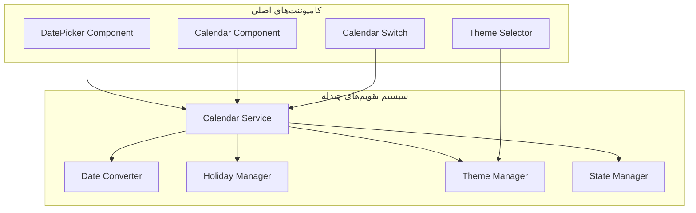
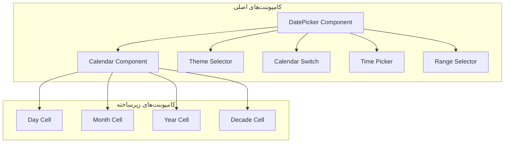

# تاریخکننده خبره‌ای حرفه‌ای با پشتیبانی از تقویم‌های جلالی، هجری، و میلادی

## چکیده‌سازی مشروعاتی

### 1. سیستم تقویم‌های چندله

#### 1.1 معماری تقویم‌های چندله


#### 1.2 معماری تقویم‌های
- **Calendar Service**: مدیریت عملکرد برای تقویم‌های مختلف
- **Date Converter**: تبدیل بین تقویم‌های مختلف
- **Holiday Manager**: مدیریت عطلیات و رویدادها
- **Theme Manager**: مدیریت بازیابی تم‌ها
- **State Manager**: مدیریت وضعیت‌های استاتی

#### 1.3 محاسبه‌های تقویم‌ها
- **Gregorian Calendar**: تقویم میلادی
- **Jalali Calendar**: تقویم شمسی
- **Hijri Calendar**: تقویم قمری

### 2. سیستم مدیریت تقویم‌ها

#### 2.1 مدیریت تقویم‌های
```typescript
interface CalendarService {
  getCurrentCalendar(): CalendarType;
  switchCalendar(calendar: CalendarType): void;
  getAvailableCalendars(): CalendarType[];
  getCalendarInfo(calendar: CalendarType): CalendarInfo;
}

interface DateConverter {
  convert(from: CalendarType, to: CalendarType, date: Date): Date;
  convertRange(from: CalendarType, to: CalendarType, range: DateRange): DateRange;
  getConversionMatrix(): ConversionMatrix;
}

interface HolidayManager {
  getHolidays(calendar: CalendarType, year: number, month?: number): Holiday[];
  isHoliday(date: Date, calendar?: CalendarType): boolean;
  getHolidayInfo(date: Date, calendar?: CalendarType): HolidayInfo;
  addHoliday(holiday: Holiday): void;
  removeHoliday(holidayId: string): void;
}
```

#### 2.2 الگوریتم‌های تبدیل
- **Julian Day Number**: استفاده از شماره‌های جلالی
- **Astronomical Algorithms**: الگوریتم‌های دقیق برای تقویم‌ها
- **Caching System**: کش نتایج محاسبات مستمر

### 3. سیستم مبدل‌سازی تقویم‌ها

#### 3.1 مدیریت بازیابی
```typescript
interface ThemeManager {
  getAvailableThemes(): Theme[];
  getCurrentTheme(): Theme;
  setTheme(themeName: string): void;
  createCustomTheme(theme: CustomTheme): void;
  deleteCustomTheme(themeName: string): void;
  applyTheme(theme: Theme): void;
}

interface Theme {
  name: string;
  displayName: string;
  isDark: boolean;
  colors: ColorPalette;
  typography: Typography;
  spacing: Spacing;
  shadows: Shadows;
  animations: Animations;
}
```

#### 3.2 ساختار رنگ‌ها
- **CSS Variables**: استفاده از CSS custom properties
- **CSS-in-JS**: استفاده دینامیکی CSS-in-JS
- **SCSS Architecture**: ساختار SCSS modular

#### 3.3 قابلیت‌های تم
- **Light/Dark Mode**: پشتیبانی از تم روشن/تاریک
- **Color Schemes**: طیف‌های رنگی مقدم
- **Typography**: سیستم‌های تایپوگرافی
- **Animations**: انیمیشن‌های سفارشی

## 2. سیستم تیم‌های و UI/UX

### 4. ساختار کامپوننت‌ها

#### 4.1 سلایسه‌بندی کامپوننت‌ها


#### 4.2 رابطه‌های کامپوننت‌ها
- **DatePicker**: کامپوننت اصلی انتخاب تاریخ
- **Calendar**: مدیریت نمایش تقویم
- **ThemeSelector**: انتخاب تم‌ها
- **CalendarSwitch**: سوییچ بین تقویم‌ها
- **TimePicker**: انتخاب زمان
- **RangeSelector**: انتخاب بازه

#### 4.3 مدیریت وضعیت
```typescript
interface DatePickerState {
  selectedDate: Date | null;
  selectedRange: DateRange | null;
  selectedDates: Date[];
  currentView: CalendarView;
  currentCalendar: CalendarType;
  theme: Theme;
  locale: Locale;
  minDate: Date | null;
  maxDate: Date | null;
  disabledDates: Date[];
  disabledDays: DayOfWeek[];
}

interface CalendarView {
  type: 'day' | 'month' | 'year' | 'decade';
  year: number;
  month: number;
  decade: number;
}
```

### 5. سیستم انیمیشن‌ها

#### 5.1 انیمیشن‌های اصلی
- **Open/Close Animation**: انیمیشن باز و بستن
- **Date Selection**: انیمیشن انتخاب تاریخ
- **Month Navigation**: انیمیشن همراه سریان
- **Theme Transition**: تغییر بین تم‌ها

#### 5.2 انیمیشن‌های متقابله
- **CSS Transitions**: انتقالی با CSS transitions
- **Web Animations API**: استفاده از Web Animations API
- **GSAP Integration**: انتگرال با GSAP

### 6. سیستم دسترسی

#### 6.1 ارئه‌رهنمای دسترسی
- **ARIA Labels**: برچسب‌های دسترسی
- **Keyboard Navigation**: ناوبری با کیبورد
- **Screen Reader Support**: پشتیبانی از صفحه‌خوان
- **High Contrast Mode**: حالت کنتراست بالا

#### 6.2 ارئه‌رهنمای لوکالیزهشن
- **Responsive Design**: طراحی وب مناسب
- **Touch Support**: پشتیبانی از لمسی
- **Mouse Wheel Navigation**: ناوبری با اسکرول
- **Drag & Drop**: کشیدن و رها انتخاب بازه

## 3. قابلیت‌های پیشرفته

### 7. سیستم انتخاب بازه

#### 7.1 مدیریت انتخاب بازه
```typescript
interface RangeSelection {
  start: Date | null;
  end: Date | null;
  isSelecting: boolean;
  selectionMode: 'single' | 'range' | 'multiple';
  minRange: number;
  maxRange: number;
}

interface MultipleSelection {
  selectedDates: Date[];
  maxSelection: number;
  selectionOrder: 'chronological' | 'user';
  allowDuplicates: boolean;
}
```

#### 7.2 ارئه‌رهنمای انتخاب
- **Single Date**: انتخاب تك‌تاریخ
- **Date Range**: انتخاب بازه تاریخ
- **Multiple Dates**: انتخاب چند تاریخ
- **Week Selection**: انتخاب هفته
- **Month Selection**: انتخاب ماه

### 8. سیستم رخداداری

#### 8.1 مدیریت رخداداری
```typescript
interface EventManager {
  addEventListener(event: EventType, handler: EventHandler): void;
  removeEventListener(event: EventType, handler: EventHandler): void;
  triggerEvent(event: EventType, data: EventData): void;
  getEventListeners(event: EventType): EventHandler[];
}

interface EventHandler {
  (event: Event): void;
}

enum EventType {
  DATE_SELECT = 'dateSelect',
  DATE_CHANGE = 'dateChange',
  CALENDAR_SWITCH = 'calendarSwitch',
  THEME_CHANGE = 'themeChange',
  RANGE_SELECT = 'rangeSelect',
  MULTIPLE_SELECT = 'multipleSelect'
}
```

#### 8.2 ارئه‌رهنمای رخداداری
- **Date Selection Events**: رخداداری انتخاب تاریخ
- **Calendar Switch Events**: رخداداری سوییچ تقویم
- **Theme Change Events**: رخداداری تغییر تم
- **Range Selection Events**: رخداداری انتخاب بازه

### 9. سیستم بین‌الملل‌سازی

#### 9.1 مدیریت بین‌الملل‌سازی
```typescript
interface Internationalization {
  locale: Locale;
  translations: TranslationMap;
  numberFormat: NumberFormat;
  dateFormat: DateFormat;
  calendarType: CalendarType;
  holidays: HolidayMap;
}

interface Locale {
  language: string;
  region: string;
  direction: 'ltr' | 'rtl';
  calendar: CalendarType;
  firstDayOfWeek: DayOfWeek;
}
```

#### 9.2 پشتیبانی زبان‌ها
- **Persian (fa)**: پشتیبانی فارسی
- **English (en)**: پشتیبانی انگلیسی
- **Arabic (ar)**: پشتیبانی عربی
- **Kurdish (ku)**: پشتیبانی کردی
- **Turkish (tr)**: پشتیبانی ترکی

## 4. بهینه‌سازی و بهینه‌رسانی

### 10. بهینه‌سازی عملکردی

#### 10.1 استراتژی‌های مورد نظر
- **Virtual Scrolling**: اسکرول مجازی برای سال‌های طولانی
- **Lazy Loading**: بارگذاری تنبل تقویم‌ها
- **Debouncing**: دیبانسینگ رخداداری
- **Throttling**: تروتلینگ عملکردها

#### 10.2 بهینه‌رسانی حافظ
- **Memory Management**: مدیریت حافظه‌ی حافظه
- **Garbage Collection**: جمعی‌آوری حافظه‌ها
- **Object Pooling**: مورد شناسایی شئونه
- **Event Cleanup**: پاکساژی رخداداری

### 11. بهینه‌سازی بندله

#### 11.1 بهینه‌سازی بندله
- **Bundle Splitting**: تولید بندله‌ها
- **Tree Shaking**: تمیز کد‌های غیرمستفاده
- **Code Splitting**: تولید کد به قسم‌ها
- **Lazy Loading**: بارگذاری تنبل کامپوننت‌ها

#### 11.2 بهینه‌سازی عملکردی
- **OnPush Strategy**: استفاده از ChangeDetectionStrategy.OnPush
- **Immutable Data**: داده‌های غیرقابل پذیرفت
- **Pure Functions**: تابع‌های خالص
- **Memoization**: ممورزه‌سازی نتایج

## 5. مورد نهایی و ارشادها

### 12. مورد نهایی

#### 12.1 مورد نهایی اصلی
```typescript
interface DatePickerOptions {
  calendarType: CalendarType;
  theme: Theme;
  locale: Locale;
  minDate: Date | null;
  maxDate: Date | null;
  disabledDates: Date[];
  disabledDays: DayOfWeek[];
  selectionMode: 'single' | 'range' | 'multiple';
  showTime: boolean;
  showHolidays: boolean;
  showWeekNumbers: boolean;
  firstDayOfWeek: DayOfWeek;
  dateFormat: string;
  timeFormat: string;
  animations: boolean;
  responsive: boolean;
}
```

#### 12.2 مورد نهایی پیشفرض
```typescript
interface AdvancedOptions {
  virtualScroll: boolean;
  lazyLoading: boolean;
  caching: boolean;
  debounceTime: number;
  throttleTime: number;
  maxCacheSize: number;
  eventListeners: boolean;
  accessibility: boolean;
  rtlSupport: boolean;
  touchSupport: boolean;
}
```

### 13. ارشادها

#### 13.1 ارشادهای فنی
```typescript
interface API {
  selectDate(date: Date): void;
  selectRange(start: Date, end: Date): void;
  selectMultiple(dates: Date[]): void;
  goToDate(date: Date): void;
  goToMonth(year: number, month: number): void;
  goToYear(year: number): void;
  setTheme(theme: Theme): void;
  setLocale(locale: Locale): void;
  setMinDate(date: Date): void;
  setMaxDate(date: Date): void;
  disableDates(dates: Date[]): void;
  disableDays(days: DayOfWeek[]): void;
  addEventListener(event: EventType, handler: EventHandler): void;
  removeEventListener(event: EventType, handler: EventHandler): void;
}
```

#### 13.2 ارشادهای توسعه
```typescript
interface DeveloperTools {
  getVersion(): string;
  getBuildInfo(): BuildInfo;
  getPerformanceMetrics(): PerformanceMetrics;
  getMemoryUsage(): MemoryUsage;
  getEventListeners(): EventListener[];
  debugMode(enable: boolean): void;
  logLevel(level: LogLevel): void;
  setConfig(config: Config): void;
}
```

### 14. مستندات و منابع

#### 14.1 مستندات API
```typescript
interface Documentation {
  apiReference: APIReference;
  tutorials: Tutorial[];
  examples: Example[];
  guides: Guide[];
  troubleshooting: Troubleshooting;
  faq: FAQ;
  changelog: Changelog;
}

interface APIReference {
  components: Component[];
  services: Service[];
  directives: Directive[];
  pipes: Pipe[];
  interfaces: Interface[];
  enums: Enum[];
  types: Type[];
}
```

#### 14.2 منابع و مثال
```typescript
interface Examples {
  basicUsage: Example;
  customTheme: Example;
  rangeSelection: Example;
  multipleSelection: Example;
  customCalendar: Example;
  integration: Example;
  accessibility: Example;
  performance: Example;
}

interface Examples {
  basicUsage: Example;
  customTheme: Example;
  rangeSelection: Example;
  multipleSelection: Example;
  customCalendar: Example;
  integration: Example;
  accessibility: Example;
  performance: Example;
}
```

## 6. محدودیت‌های و الگوریتم‌ها

### 15. الگوریتم‌های اصلی

#### 15.1 الگوریتم‌های مورد نظر
- **TypeScript**: نوع نویسی استاتیکس
- **Angular**: اطاره مبتنی برای وب
- **RxJS**: مدیریت رخداداری وضعیت
- **SCSS**: ساختار سیاستگذاری
- **Web Animations API**: استفاده از انیمیشن‌ها

#### 15.2 الگوریتم‌های متمرکز
- **Date-fns**: کتابخانه عملکرد با تاریخ
- **Luxon**: کتابخانه عملکرد با تاریخ
- **Moment.js**: کتابخانه عملکرد تاریخ
- **Lodash**: کتابخانه عملکرد عمومی

### 16. الگوریتم‌های توسعه

#### 16.1 الگوریتم‌های برای بهینه‌رسانی
- **ESLint**: استان‌های کد
- **Prettier**: فرمتبندی کد
- **Husky**: هوک‌های Git
- **Commitizen**: استاندهای کمیت
- **Semantic Release**: اصدارات نسخه

#### 16.2 الگوریتم‌های برای بهینه‌سازی
- **Jest**: تست‌واحد واحد
- **Cypress**: تست‌های سرتاسری
- **Storybook**: تولید کامپوننت‌ها
- **Playwright**: تست‌واحد وب
- **Vitest**: تست‌واحد سریع

### 17. مشاکل‌سازی و انتشار

#### 17.1 مشاکل‌سازی
- **Webpack**: بندله‌سازی
- **Vite**: بندله‌سازی سریع
- **Rollup**: بندله‌سازی برای کتابخانه‌ها
- **Parcel**: بندله‌سازی بهینه‌رسانی

#### 17.2 انتشار
- **Git**: مدیریت نسخه
- **GitHub Actions**: انتشارهای CI/CD
- **Docker**: بستره‌سازی
- **Kubernetes**: برنامه‌نویسی

### 18. استانه‌های و قوانین

#### 18.1 استانه‌های مورد نظر
- **ESLint Config**: پوشه‌بندی استان‌ها
- **Prettier Config**: پوشه‌بندی فرمتبندی
- **TypeScript Config**: پوشه‌بندی TypeScript
- **Angular Config**: پوشه‌بندی Angular

#### 18.2 قوانین و استانداردها
- **Code Style**: استان‌دهی کد
- **Naming Conventions**: قانون‌های نامگذاری
- **File Structure**: ساختار فایل
- **Component Architecture**: معماری کامپوننت‌ها

## 7. نقشه‌جایی و ارزیابی

### 19. نقشه‌جایی اصلی

#### 19.1 مقداره‌سازی اولیه
```typescript
interface InitialSetup {
  createProjectStructure(): void;
  installDependencies(): void;
  configureBuildTools(): void;
  setupTestingFramework(): void;
  initializeGitRepository(): void;
}
```

#### 19.2 مقداره‌سازی نهایی
```typescript
interface MVPSetup {
  implementCoreCalendarService(): void;
  implementDateConverter(): void;
  implementThemeManager(): void;
  implementDatePickerComponent(): void;
  implementCalendarComponent(): void;
  implementThemeSelector(): void;
  implementCalendarSwitch(): void;
}
```

### 20. ارزیابی

#### 20.1 ارزیابی اصلی
```typescript
interface Deployment {
  buildForProduction(): void;
  optimizeBundle(): void;
  configureCDN(): void;
  setupMonitoring(): void;
  configureAnalytics(): void;
  setupErrorTracking(): void;
}
```

#### 20.2 ارزیابی پیشرفته
```typescript
interface AdvancedDeployment {
  implementProgressiveWeb App(): void;
  configureServiceWorker(): void;
  setupOfflineSupport(): void;
  implementA/B Testing(): void;
  configureFeature Flags(): void;
  setupInternationalization(): void;
}
```

### 21. نگرانی‌های آینده

#### 21.1 نگرانی‌های برای نسخه‌ها
```typescript
interface ReleaseNotes {
  version: string;
  releaseDate: Date;
  features: Feature[];
  bugFixes: BugFix[];
  improvements: Improvement[];
  breakingChanges: BreakingChange[];
  deprecations: Deprecation[];
}
```

#### 21.2 نگرانی‌های برای مشترکان
```typescript
interface MigrationGuide {
  fromVersion: string;
  toVersion: string;
  breakingChanges: BreakingChange[];
  migrationSteps: MigrationStep[];
  deprecatedFeatures: DeprecatedFeature[];
  newFeatures: NewFeature[];
  upgradeNotes: UpgradeNote[];
}
```

---

## خلاصه

این معمار مشترکی برای ساختار کتابخانه تاریخ حرفه‌ای با پشتیبانی از تقویم‌های چندله، هجری، و میلاد